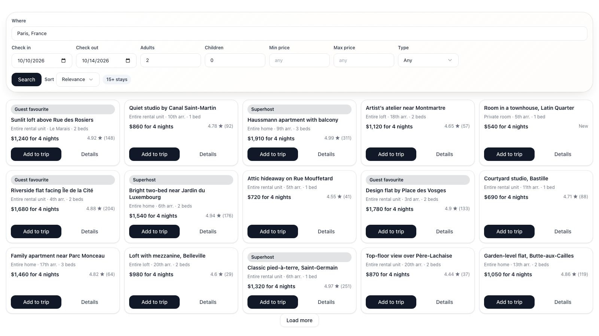

# Airbnb Stays

[](https://github.com/jjahn-source/trek-plugin-airbnb-mcp/actions/workflows/ci.yml)

Find somewhere to stay without leaving your trip — search Airbnb for your dates,
compare prices and ratings, and add the winner to the plan in one tap.

## What it does

Adds an **Airbnb** tab to the trip planner, with the search bar you already know:
where, check in, check out, and a guest picker. The destination box completes as you
type, dates are picked on a two-month range calendar, and both dates come from the trip
you are looking at — so most searches are one click. Filters for price and place type,
sorting by price or rating, and paging through more results are all there when you
want them.

Open any stay and **"Where you'll be"** shows the neighbourhood it sits in. Airbnb only
publishes an approximate location until a booking is confirmed, so the map marks an
area rather than pretending to know the front door.

Each result also shows travel time to the places already pinned on the trip. One
distance-matrix request compares up to 20 stays at once, and the traveller can
switch between transit, driving, walking and cycling without leaving the results.

A stay is somewhere you sleep, so when your check-in and check-out dates match days
on the trip it is added as a **lodging block spanning those nights** — the same thing
the planner creates by hand, partner hotel reservation included — not just a pin on
the map. Dates outside the trip still add the place on its own. Either way it keeps
its price, rating and booking dates, which show up again in the place-detail panel.

**Details** on any card opens the full listing for your dates — description, highlights,
amenities grouped the way Airbnb groups them (including what is *not* included), and the
house rules — without leaving TREK. Listings are fetched once and cached for the session.

### How the search works

Searches run against the hosted [OpenBnB MCP server](https://openbnb.ai). The plugin
holds no API key, no cookie and no shared account: every query is made with the
short-lived OAuth token of the person who typed it, which TREK obtains and stores on
their behalf. One traveller's account is never used for another's searches.

Airbnb has no public API for third-party apps, so going through OpenBnB is what makes
this work without your TREK server taking on that relationship — each traveller signs
up to OpenBnB themselves, under their own terms. Accounts are free.

If you have not connected an account yet the tab explains what to do rather than
failing; if your session expires mid-search the plugin says so and sends you back to
reconnect.

## Screenshots



## Setup

### 1. Register this TREK instance with OpenBnB (admin, once)

OpenBnB supports OAuth Dynamic Client Registration, so this is one command — no
account, no dashboard, no support ticket:

```bash
npm run register -- https://trek.example.com
```

Pass exactly your server's **`APP_URL`** — the public base URL your users reach TREK
on, *including any path* if TREK is hosted under one (`https://example.com/trek`).
TREK builds the OAuth redirect from `APP_URL`, and OpenBnB only redirects to the URI
registered here, so a mismatch shows up later as a sign-in that never completes. The
script prints the redirect URI it registers — check it against your `APP_URL`.

It registers a confidential client and prints a **client id** and **client secret**.

### 2. Give the values to TREK (admin, once)

Four settings have to reach the server. Two of them — the authorize and token URLs — are
constants of the OpenBnB service and this plugin ships them as manifest defaults, so on a
TREK new enough to honour defaults they are already filled in and you only supply the two
credentials.

**If your TREK shows a Settings form** for this plugin under **Admin → Plugins → Airbnb
Stays**, fill in `OAuth client id` and `OAuth client secret` there; everything else is
pre-filled.

**No TREK release has that form yet** — up to and including 4.1 there is no UI for a
plugin's instance settings — so today this is the path you want. Send the same values to
the admin API. Sign in to TREK as an admin, then from the browser console on
your TREK tab (it reuses your session cookie):

```js
await fetch('/api/admin/plugins/airbnb-mcp/config', {
  method: 'PUT',
  headers: { 'Content-Type': 'application/json' },
  body: JSON.stringify({
    oauth_authorize_url: 'https://mcp.openbnb.ai/authorize',
    oauth_token_url:     'https://mcp.openbnb.ai/token',
    oauth_client_id:     'PASTE_CLIENT_ID',
    oauth_client_secret: 'PASTE_CLIENT_SECRET',
  }),
}).then(r => r.json())
```

Activate the plugin first (**Admin → Plugins → Airbnb Stays**, toggle it on) — the call
above stores the settings either way, but there is nothing running to read them until it
is active.

Then **restart it**: **Admin → Plugins → ⋯ → Restart**. This step is required, not
tidiness — a plugin reads its settings once, when its process starts, so without a restart
the save appears to work and nothing changes. (Do not reach for `POST /reload`: that
endpoint is dev-only and answers 403 on a normal install. The panel's Restart is a
deactivate/activate cycle, which is the mechanism you want.)

The secret is stored encrypted either way and never leaves the host. The plugin's own tab
lists the keys still missing, so you can check your work there.

> The map and the MCP endpoint need no configuration at all — they fall back to built-in
> defaults, and their settings exist only to override them.

### 3. Each traveller connects their own account

Every user goes to **Settings → Plugins → Airbnb Stays → Connect** once and
signs in to OpenBnB with Google, an email address or SSO. OpenBnB accounts are free.
TREK never sees the password, and one person's account is never used for another's
searches. Until a user connects, the tab shows a prompt instead of a search form.

## Permissions

| Permission | Why this plugin needs it |
|---|---|
| `db:own` | Stores your last search per trip in the plugin's own table, so switching tabs and coming back does not throw the results away. |
| `db:meta` | Records the listing id, price, rating and booking dates against a place you added, so the place-detail panel can show them later. |
| `db:read:trips` | Reads the open trip's title and start/end dates to pre-fill the destination and check-in/check-out fields. |
| `db:write:places` | Creates the place on the trip when you press "Add to trip". |
| `db:write:accommodations` | When the check-in and check-out dates line up with days on the trip, the stay is added as a lodging block spanning those nights (which also creates the matching hotel reservation), rather than just a pin on the map. If the dates fall outside the trip, or you cannot edit days, the place is still added on its own. |
| `oauth:client` | Lets TREK run the OAuth flow to OpenBnB for each user and hand this plugin a short-lived access token for whoever is searching. The client secret and refresh token stay with the host. |
| `http:outbound:mcp.openbnb.ai` | The one network call this plugin makes: the MCP request that runs the search or fetches a listing's details. |
| `http:outbound:*.muscache.com` | Listing photos live on Airbnb's image CDN. The plugin frame's CSP blocks remote images, so photos are fetched here and passed to the page as data URIs. No other host is proxied. |
| `http:outbound:tile.openstreetmap.org` | Map tiles for the "Where you'll be" map in a listing's details. Same reason as the photos: the frame's CSP blocks remote images, so tiles are fetched here and passed to the page as data URIs. The tile source is an admin setting — point it at another provider and add that host under **Allowed hosts**. |
| `hook:place-detail-provider` | Adds the Airbnb link, price and rating rows to the detail panel of a place this plugin added. |

## Development

```bash
npm install
npm test          # 102 unit tests: MCP transport, session reuse, normalisation, tile maths, every route
npm run smoke     # 49 browser checks: packs the frame and drives the real UI
npm run dev       # hot-reloaded local harness
npm run validate  # the registry's own publish gates
```

`npm test` covers the server through the SDK's mock host, so the permission model is
exercised rather than stubbed. `npm run smoke` covers the half unit tests cannot reach:
it packs the plugin, loads the frame with the design kit inlined exactly as it ships, and
stands in for the host over the documented `postMessage` protocol — so the search, detail,
back and add flows are checked against the real UI, not a mock of it, along with the
first-run and not-yet-configured states, plus focus management and an
accessible-name/keyboard-reachability audit of every control.

`server/mcp.js` is a dependency-free Streamable-HTTP MCP client (a TREK plugin ships as
a flat bundle with no install step, so the official SDK is not worth its weight here).
It reuses one session per access token, re-handshakes a dropped one exactly once, and
terminates sessions it replaces rather than leaving them for the server to expire.
`server/normalize.js` flattens OpenBnB payloads into what the UI renders — it searches
for the fields it wants rather than indexing fixed paths, because the hosted endpoint
is a superset of the open-source server and both reshape whatever Airbnb's page
happens to contain.

## Verifying against the real service

The normalisers were written against the **open-source** OpenBnB server's schema. The
hosted endpoint is a superset, so its exact shapes are an assumption until something
checks them. To capture real responses:

```bash
node scripts/capture-fixtures.mjs "Paris, France" 2026-10-10 2026-10-14
```

It signs you in to OpenBnB in your browser, calls the listing and map tools, and writes the raw
payloads to `test/fixtures/hosted-*.json`. The access token stays in the process — it
is never printed and never written to disk; only public listing data is saved.

`test/hosted.test.js` runs against those fixtures. It is the only part of the suite
that checks the payload *shape* rather than assuming it, and it earns its keep: the
first capture found five shape bugs in the search payload, and the second found four
more in the listing payload — every one invisible to a fully green suite.

## Licence

MIT — see [LICENSE](./LICENSE).
